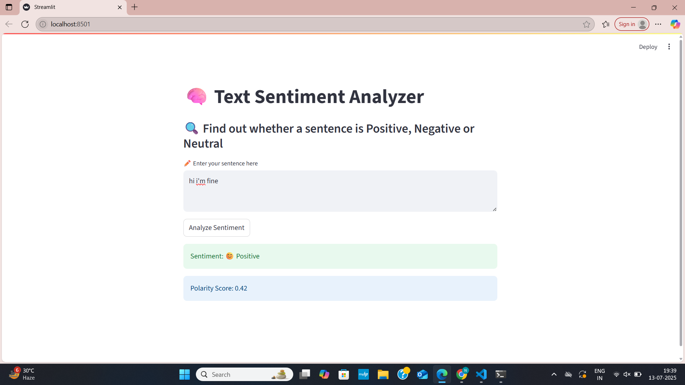

# 🧠 Text Sentiment Analyzer

A simple and interactive web app that analyzes the **sentiment** of a given sentence using **TextBlob** and **Streamlit**. It classifies input text as **Positive**, **Negative**, or **Neutral** based on polarity scores.

---

## 🚀 Demo

[](https://share.streamlit.io/your-username/Text-Sentiment-Analyzer/main/sentiment_app.py)

> *(Replace the link above with your deployed app URL if you deploy to Streamlit Cloud)*

---

## 📸 Screenshot

 
 
---

## 🛠️ Tech Stack

- **Python 3.11**
- [TextBlob](https://textblob.readthedocs.io/en/dev/) — for NLP-based sentiment analysis
- [Streamlit](https://streamlit.io/) — for building UI quickly

---

## 📦 How to Run Locally

1. Clone the repository:

```bash
git clone https://github.com/nidhi-ai01/Text-Sentiment-Analyzer.git
cd Text-Sentiment-Analyzer

Install dependencies:
pip install -r requirements.txt

Run the app:
streamlit run sentiment_app.py

 Example Inputs:

| Input Text                          | Sentiment   |
| ----------------------------------- | ----------- |
| "I love this app, it's amazing!"    | 😊 Positive |
| "This is the worst experience ever" | 😠 Negative |
| "It's okay, not good not bad."      | 😐 Neutral  |


 Show Your Support
If you like this project, please ⭐ the repo to support my work!

